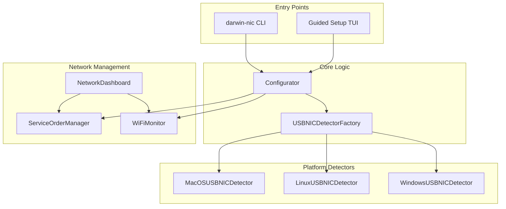
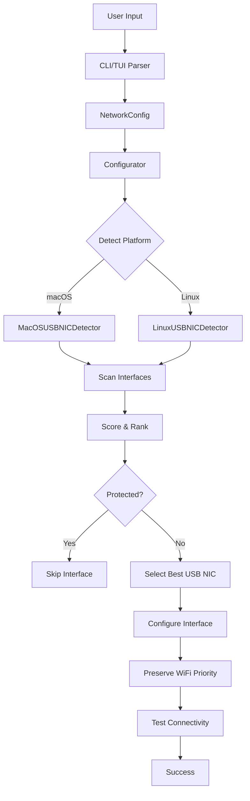
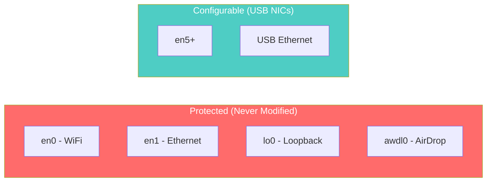
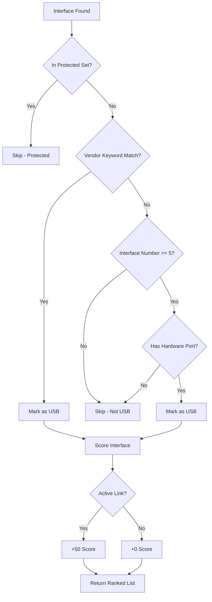
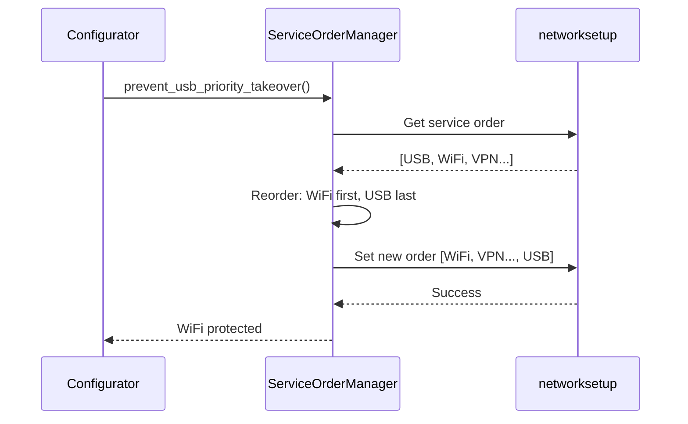
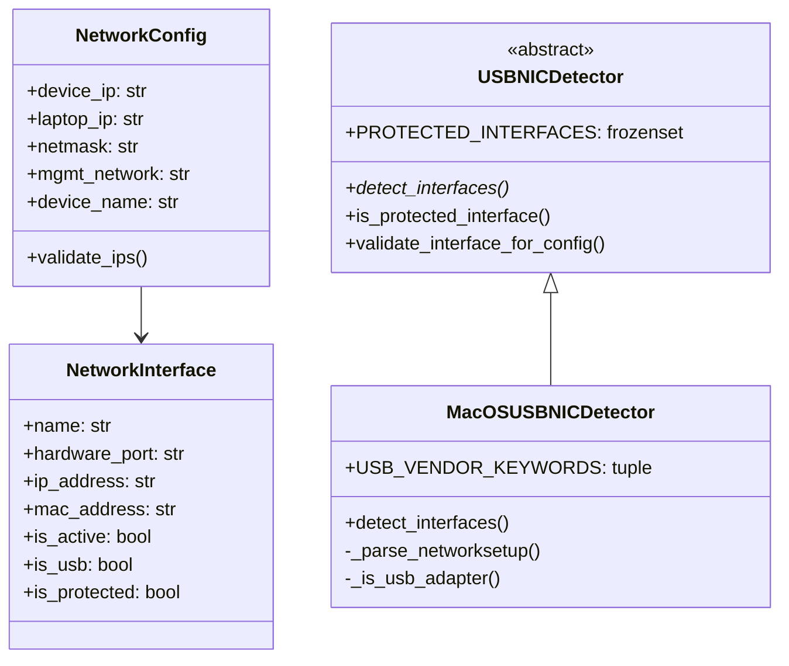

# Architecture

## Overview

Darwin Management NIC Configurator uses a factory pattern for cross-platform USB detection with multiple safety layers.



## Module Structure

```
src/darwin_mgmt_nic/
├── unified_entry.py    # Package entry point
├── cli.py              # CLI argument parsing
├── guided_setup.py     # Rich TUI wizard
├── config.py           # Configuration models
├── configurator.py     # Main orchestration
├── factory.py          # Platform factory
├── detectors.py        # Abstract base class
├── macos.py            # macOS implementation
├── linux.py            # Linux placeholder
└── network_manager.py  # Network utilities
```

## Data Flow



## Safety Architecture

### Protected Interfaces

Interfaces that are never modified:



### USB Detection Heuristics



## Interface Scoring

USB interfaces are scored using 6 factors:

| Factor | Weight | Description |
|--------|--------|-------------|
| Active Link | +50 | Interface has carrier |
| Known Vendor | +30 | Realtek, ASIX, etc. |
| Interface Number | +10 | Higher en# preferred |
| Hardware Port | +10 | Valid port name |
| Not Protected | +100 | Must pass protection check |
| Cable Quality | +5 | USB 3.0 vs 2.0 |

## WiFi Preservation



## Configuration Models



## Platform Support

| Platform | Status | Detection Method |
|----------|--------|------------------|
| macOS | Complete | `networksetup -listallhardwareports` |
| Linux | Planned | `ip link`, `nmcli` |
| Windows | Planned | `netsh`, PowerShell |
