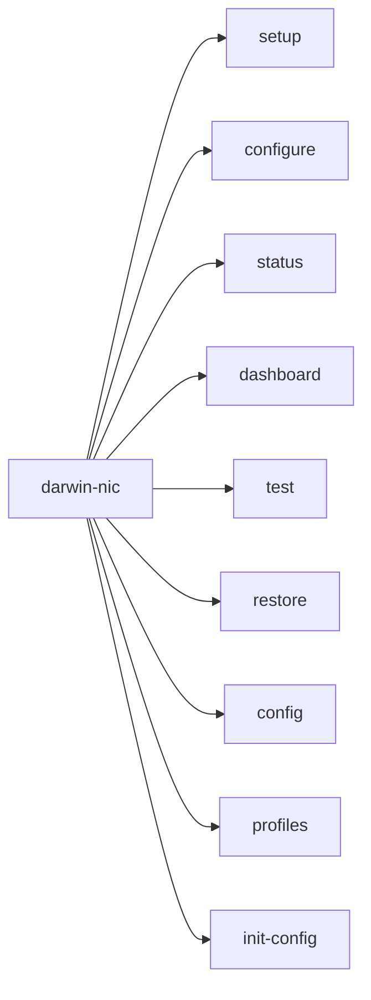

# CLI Reference

## Commands



## darwin-nic setup

Interactive guided setup wizard with Rich TUI.

```bash
darwin-nic setup
```

Walks through:

1. Baseline detection (no USB NIC)
2. USB NIC insertion detection
3. Cable connection guidance
4. IP configuration
5. Connectivity verification

## darwin-nic configure

CLI configuration for scripting and automation.

```bash
darwin-nic configure [OPTIONS]
```

### Options

| Option | Default | Description |
|--------|---------|-------------|
| `--profile NAME` | - | Use named profile from config file |
| `--device-ip IP` | From config | Management device IP address |
| `--laptop-ip IP` | From config | Your USB NIC IP address |
| `--netmask MASK` | `255.255.255.0` | Network mask |
| `--mgmt-network CIDR` | From config | Management network |
| `--device-name NAME` | From config | Device identifier |
| `--preserve-wifi` | Off | Preserve WiFi connectivity |
| `--dry-run` | Off | Preview without applying |
| `--show-dashboard` | Off | Show network dashboard |

When using `--profile`, device-ip and laptop-ip are loaded from the config file.
Without `--profile`, they are required on the command line.

### Examples

```bash
# Use a saved profile
darwin-nic configure --profile homelab

# Use profile with dry-run
darwin-nic configure --profile homelab --dry-run

# Manual configuration
darwin-nic configure --device-ip 192.0.2.1 --laptop-ip 192.0.2.100

# With WiFi preservation
darwin-nic configure \
  --device-ip 192.0.2.1 \
  --laptop-ip 192.0.2.100 \
  --preserve-wifi

# Custom network
darwin-nic configure \
  --device-ip 10.0.0.1 \
  --laptop-ip 10.0.0.100 \
  --netmask 255.255.0.0 \
  --mgmt-network 10.0.0.0/16
```

## darwin-nic status

Display current network status.

```bash
darwin-nic status
```

Shows:

- Active interfaces
- WiFi status
- USB NIC status
- Service order

## darwin-nic dashboard

Real-time network monitoring dashboard.

```bash
darwin-nic dashboard [OPTIONS]
```

### Options

| Option | Description |
|--------|-------------|
| `--interference` | Monitor for USB 3.0 interference |
| `--duration SECONDS` | Monitoring duration |

### Examples

```bash
# Static dashboard
darwin-nic dashboard

# Monitor interference for 60 seconds
darwin-nic dashboard --interference --duration 60
```

## darwin-nic test

Test connectivity to common endpoints.

```bash
darwin-nic test
```

Tests:

- Local interfaces (en0, en1, en11)
- Common management IPs (192.0.2.1, 192.168.1.1)
- Internet connectivity (8.8.8.8)

## darwin-nic restore

Restore backup network configuration.

```bash
darwin-nic restore
```

Restores:

- Service order backup
- WiFi priority

## Configuration Commands

### darwin-nic config

Display current configuration and available profiles.

```bash
darwin-nic config
```

Shows:

- Config file locations and which are loaded
- Current settings (device IP, laptop IP, etc.)
- Available profiles with their settings

### darwin-nic profiles

List available profiles from config files.

```bash
darwin-nic profiles
```

### darwin-nic init-config

Initialize a user config file with defaults.

```bash
darwin-nic init-config
```

Creates `~/.config/darwin-nic/config.toml` with example profiles.

## Configuration Files

Settings are loaded from TOML config files in order of precedence:

| Location | Purpose |
|----------|---------|
| `/etc/darwin-nic/config.toml` | System-wide defaults |
| `~/.config/darwin-nic/config.toml` | User settings |
| `./.darwin-nic.toml` | Directory-local override |

### Example Config

```toml
default_profile = "homelab"

[defaults]
netmask = "255.255.255.0"
preserve_wifi = true

[profiles.homelab]
device_ip = "192.168.88.1"
laptop_ip = "192.168.88.100"
mgmt_network = "192.168.10.0/24"
device_name = "Management Switch"
description = "Home lab network"

[profiles.datacenter]
device_ip = "10.200.0.1"
laptop_ip = "10.200.0.100"
mgmt_network = "10.200.0.0/24"
device_name = "DC Core Switch"
```

See `examples/config.toml` for a full example.

## Global Options

| Option | Description |
|--------|-------------|
| `--version` | Show version and exit |
| `--help` | Show help and exit |

## Exit Codes

| Code | Meaning |
|------|---------|
| 0 | Success |
| 1 | Error or cancelled by user |
