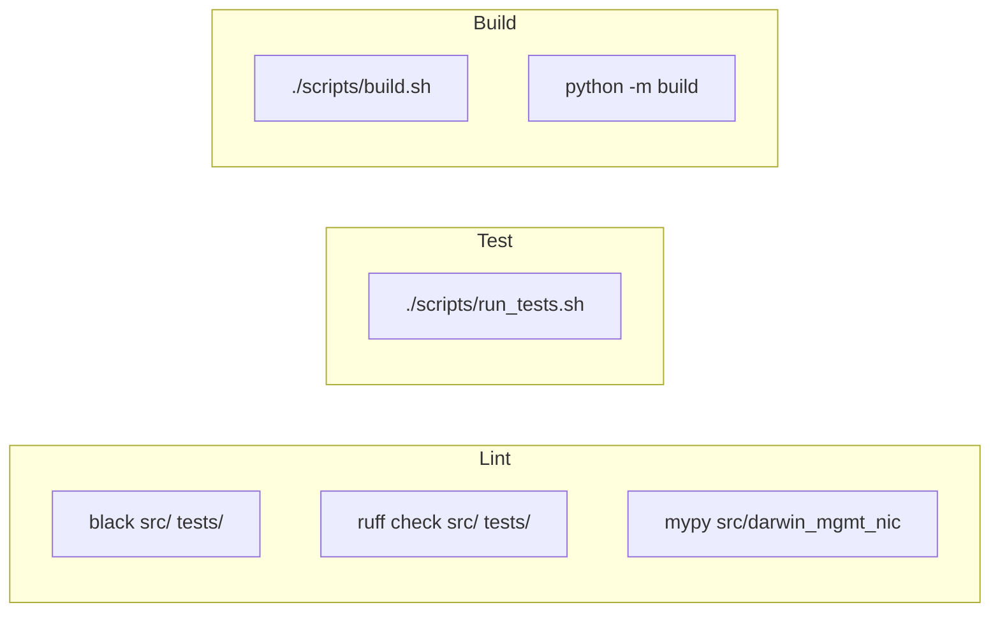
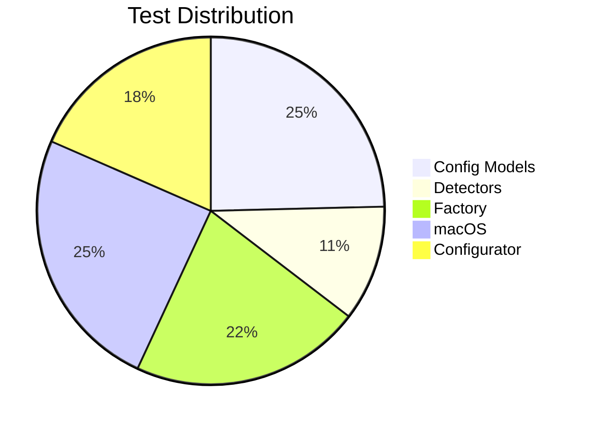
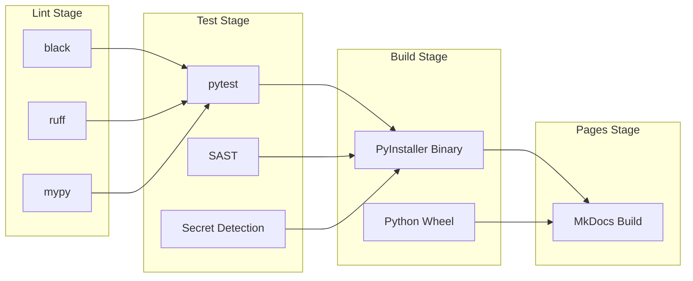

# Development

## Setup

```bash
# Clone repository
git clone https://gitlab.com/tinyland/projects/darwin-mgmt-nic-configurator.git
cd darwin-mgmt-nic-configurator

# Create virtual environment (Python 3.14+)
python3 -m venv venv
source venv/bin/activate

# Install with dev dependencies
pip install -e ".[dev]"
```

## Project Structure

```
darwin-mgmt-nic-configurator/
├── darwin-nic              # Main entry point
├── darwin-nic-venv         # Venv wrapper
├── src/darwin_mgmt_nic/    # Source code
├── tests/                  # Test suite
├── docs/                   # Documentation
├── pyproject.toml          # Project config
└── mkdocs.yml              # Docs config
```

## Commands



### Linting

```bash
# Format code
black src/ tests/

# Lint code
ruff check src/ tests/

# Type check
mypy src/darwin_mgmt_nic
```

### Testing

```bash
# Run all tests with coverage
./scripts/run_tests.sh

# Run specific test
pytest tests/test_config.py::TestNetworkConfig::test_validation -v

# Run with verbose output
pytest tests/ -v --tb=short
```

### Building

```bash
# Build PyInstaller binary
./scripts/build.sh

# Build wheel
python -m build
```

## Code Style

| Rule | Value |
|------|-------|
| Line length | 120 characters |
| Python version | 3.14+ (PEP 750) |
| Formatter | Black |
| Linter | Ruff |
| Type checker | mypy (strict) |

### Type Hints

All functions require type hints:

```python
def configure_interface(
    interface: str,
    ip_address: str,
    netmask: str = "255.255.255.0"
) -> bool:
    """Configure network interface."""
    ...
```

### Dataclasses

Use frozen dataclasses with slots:

```python
@dataclass(frozen=True, slots=True)
class NetworkConfig:
    device_ip: str
    laptop_ip: str
    netmask: str = "255.255.255.0"
```

## Testing

### Test Categories



### Writing Tests

```python
import pytest
from darwin_mgmt_nic.config import NetworkConfig

class TestNetworkConfig:
    def test_valid_config(self):
        config = NetworkConfig(
            device_ip="192.0.2.1",
            laptop_ip="192.0.2.100",
            netmask="255.255.255.0",
            mgmt_network="198.51.100.0/24",
            device_name="Test"
        )
        assert config.device_ip == "192.0.2.1"

    def test_invalid_ip_raises(self):
        with pytest.raises(ValueError):
            NetworkConfig(
                device_ip="invalid",
                laptop_ip="192.0.2.100",
                ...
            )
```

### Fixtures

Common fixtures are in `tests/conftest.py`:

```python
@pytest.fixture
def mock_networksetup(mocker):
    """Mock networksetup command output."""
    return mocker.patch("subprocess.run", ...)
```

## CI/CD Pipeline



## Contributing

1. Fork the repository
2. Create feature branch: `git checkout -b feature/amazing-feature`
3. Make changes
4. Add tests
5. Run linting: `black . && ruff check .`
6. Run tests: `./scripts/run_tests.sh`
7. Commit: `git commit -m 'Add amazing feature'`
8. Push: `git push origin feature/amazing-feature`
9. Open Merge Request

### Commit Messages

Use conventional commits:

- `feat:` New feature
- `fix:` Bug fix
- `docs:` Documentation
- `refactor:` Code refactoring
- `test:` Test changes
- `chore:` Maintenance

## Releasing

```bash
# Update version in pyproject.toml
# Create tag
git tag -a v2.1.0 -m "Release v2.1.0"
git push origin v2.1.0

# CI will build and publish artifacts
```
