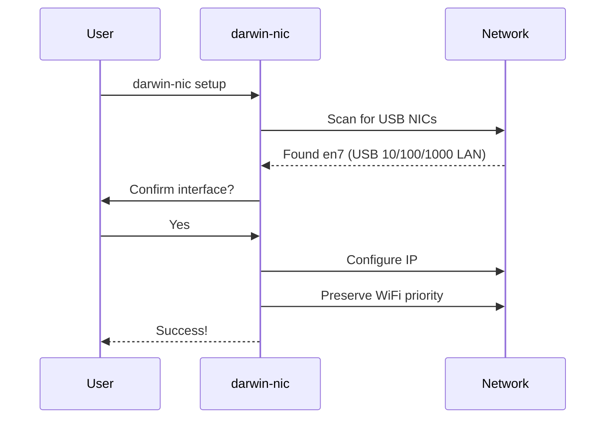

# Quick Start

Get up and running in under 5 minutes.

## Installation

=== "Clone & Run"

    ```bash
    git clone https://gitlab.com/tinyland/projects/darwin-mgmt-nic-configurator.git
    cd darwin-mgmt-nic-configurator

    python3 -m venv venv
    source venv/bin/activate
    pip install -e .

    ./darwin-nic setup
    ```

=== "Venv Wrapper"

    ```bash
    # Automatically activates venv and installs dependencies
    ./darwin-nic-venv setup
    ```

=== "Binary (No Python)"

    ```bash
    # Download pre-built binary from releases
    chmod +x darwin-nic
    ./darwin-nic setup
    ```

## Interactive Setup

The guided setup wizard walks you through the entire process:

```bash
./darwin-nic setup
```



## Configuration File

Save your network settings to avoid typing IPs every time:

```bash
# Initialize config file
darwin-nic init-config

# View current settings
darwin-nic config

# List profiles
darwin-nic profiles
```

Edit `~/.config/darwin-nic/config.toml`:

```toml
default_profile = "homelab"

[profiles.homelab]
device_ip = "192.168.88.1"
laptop_ip = "192.168.88.100"
mgmt_network = "192.168.10.0/24"
device_name = "Management Switch"
```

## CLI Configuration

For scripting or quick configuration:

```bash
# Use a saved profile
darwin-nic configure --profile homelab

# Or specify IPs directly
darwin-nic configure \
  --device-ip 192.0.2.1 \
  --laptop-ip 192.0.2.100 \
  --preserve-wifi
```

### Options

| Option | Description | Default |
|--------|-------------|---------|
| `--profile` | Use named profile | - |
| `--device-ip` | Management device IP | From config |
| `--laptop-ip` | Your USB NIC IP | From config |
| `--netmask` | Network mask | `255.255.255.0` |
| `--preserve-wifi` | Keep WiFi as primary | Off |
| `--dry-run` | Preview without changes | Off |

## Verify Configuration

```bash
# Check status
./darwin-nic status

# Test connectivity
./darwin-nic test

# Real-time monitoring
./darwin-nic dashboard
```

## Troubleshooting

### USB Interface Not Detected

```bash
# Check if adapter is recognized
networksetup -listallhardwareports
```

### Permission Denied

```bash
# Run with sudo
sudo ./darwin-nic configure --device-ip 192.0.2.1 --laptop-ip 192.0.2.100
```

### Emergency Recovery

```bash
./scripts/emergency-restore.sh
```
