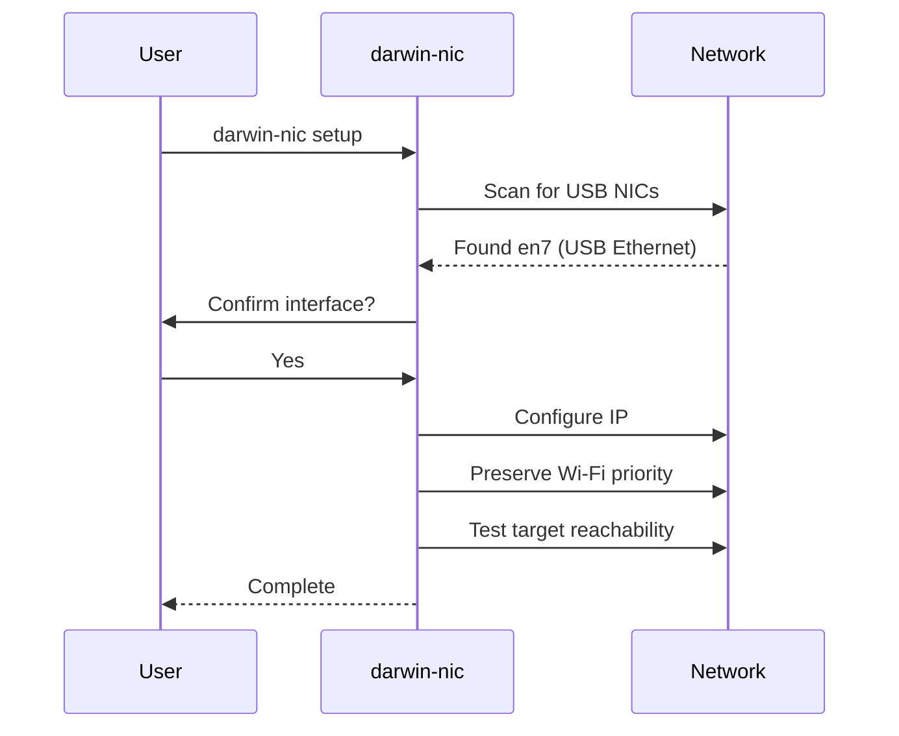

# Quick Start

Get a USB management NIC configured without letting it take over normal Wi-Fi or tailnet connectivity.

## Installation

=== "Nix"

    ```bash
    nix run github:Jesssullivan/DarwinNicUtil -- setup

    nix run github:Jesssullivan/DarwinNicUtil -- configure \
      --device-ip 192.168.88.1 \
      --laptop-ip 192.168.88.100 \
      --mgmt-network 192.168.88.0/24 \
      --preserve-wifi
    ```

=== "Source"

    ```bash
    git clone https://github.com/Jesssullivan/DarwinNicUtil.git
    cd DarwinNicUtil

    uv sync --extra dev
    uv run darwin-nic setup
    ```

=== "uv Tool"

    ```bash
    git clone https://github.com/Jesssullivan/DarwinNicUtil.git
    cd DarwinNicUtil

    uv tool install .
    darwin-nic setup
    ```

## Interactive Setup

The guided setup wizard walks through USB NIC detection, IP configuration, Wi-Fi preservation, and a connectivity check.

```bash
darwin-nic setup
```


```mermaid
sequenceDiagram
    participant U as User
    participant D as darwin-nic
    participant N as Network

    U->>D: darwin-nic setup
    D->>N: Scan for USB NICs
    N-->>D: Found en7 (USB Ethernet)
    D->>U: Confirm interface?
    U->>D: Yes
    D->>N: Configure IP
    D->>N: Preserve Wi-Fi priority
    D->>N: Test target reachability
    D-->>U: Complete
```

## Configuration File

Save network settings to avoid typing IPs every time:

```bash
# Initialize config file
darwin-nic init-config

# View current settings
darwin-nic config

# List profiles
darwin-nic profiles
```

Edit `~/.config/darwin-nic/config.toml`:

```toml
default_profile = "homelab"

[defaults]
preserve_wifi = true

[profiles.homelab]
device_ip = "192.168.88.1"
laptop_ip = "192.168.88.100"
mgmt_network = "192.168.88.0/24"
device_name = "Lab Management Device"
device_type = "network"
```

Then run:

```bash
darwin-nic configure --profile homelab --preserve-wifi
```

## CLI Configuration

For scripting or one-off setup:

```bash
darwin-nic configure \
  --device-ip 192.168.88.1 \
  --laptop-ip 192.168.88.100 \
  --mgmt-network 192.168.88.0/24 \
  --preserve-wifi
```

### Options

| Option | Description | Default |
|--------|-------------|---------|
| `--profile` | Use named profile | - |
| `--device-ip` | Management device IP | From config |
| `--laptop-ip` | USB NIC IP to assign locally | From config |
| `--netmask` | Network mask | `255.255.255.0` |
| `--mgmt-network` | Management network CIDR | From config |
| `--preserve-wifi` | Keep Wi-Fi as primary | Off |
| `--dry-run` | Preview without changes | Off |

## Verify Configuration

```bash
# Check status, routes, and bastion/OOB diagnostics
darwin-nic status

# Test connectivity
darwin-nic test

# Real-time monitoring
darwin-nic dashboard
```

If `status` shows the USB interface missing from `scutil --nwi` while the
Tailscale system extension is active, ordinary sockets may be blocked by macOS
NECP even though link-layer tools and ARP still work.

## Troubleshooting

### USB Interface Not Detected

```bash
# Check if adapter is recognized
networksetup -listallhardwareports
```

### Permission Denied

```bash
# Pre-authenticate sudo, then rerun configure
sudo -v
darwin-nic configure \
  --device-ip 192.168.88.1 \
  --laptop-ip 192.168.88.100 \
  --mgmt-network 192.168.88.0/24
```

### Emergency Recovery

```bash
./scripts/emergency-restore.sh
```
